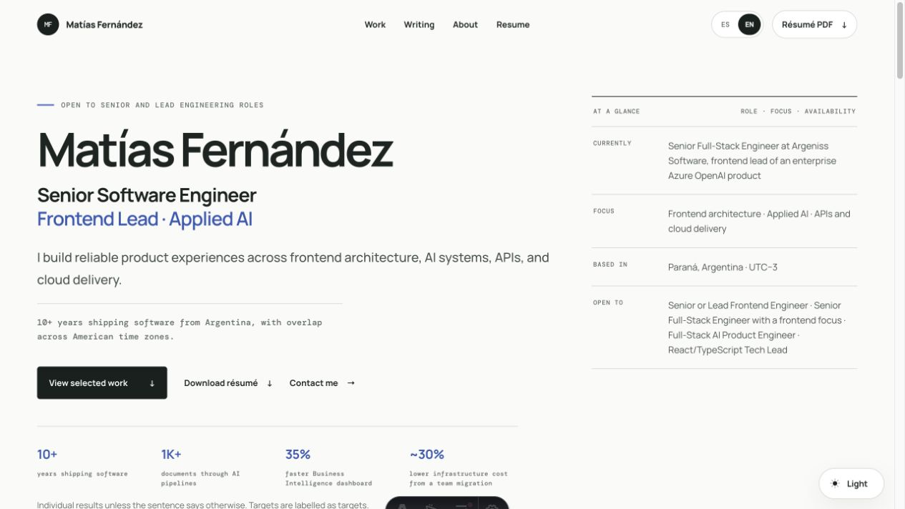

# Matías Fernández — Professional Portfolio

The source for [builtbymatias.dev](https://builtbymatias.dev): a bilingual, hiring-focused
portfolio for a Senior Software Engineer with frontend leadership depth and hands-on applied AI,
API, and cloud experience.

**Status:** actively maintained and deployed on Cloudflare Pages. The professional home, selected
work, case studies, About pages, writing archive, and two résumé positioning variants are live in
English and Spanish.

[Live portfolio](https://builtbymatias.dev/en/) ·
[Selected work](https://builtbymatias.dev/en/work/) ·
[About](https://builtbymatias.dev/en/about/) ·
[Résumé](https://builtbymatias.dev/en/cv/)



## The problem

A technical portfolio has to do more than collect projects. It should let a recruiter or hiring
manager understand the engineer's focus, verified evidence, ownership, and next action without
guessing which claims are current or which work can be discussed publicly.

This site keeps professional positioning, evidence-backed outcomes, selected experience, case
studies, writing, and résumé outputs aligned across two languages. Client-based work is published
only through sanitized case studies with explicit ownership and disclosure boundaries.

## Key features

- English and Spanish professional homes with shared positioning and verified proof metrics.
- A selected-work index and three bilingual engineering case studies with explicit ownership,
  decisions, trade-offs, failure modes, and evidence.
- About pages focused on leadership behavior, working style, experience, and preferred environment.
- Frontend Lead and AI Product Engineer résumé variants generated from one shared experience source,
  available as accessible web pages and four committed PDFs.
- A technical writing archive covering applied AI, system design, data, and product engineering.
- Static output, semantic HTML, keyboard navigation, visible focus, reduced-motion support, responsive
  layouts, light/dark themes, canonical URLs, Open Graph metadata, and `hreflang` alternates.

## Architecture

```text
src/content/*.ts ─┐
                  ├─> Astro components ─> bilingual routes ─> static HTML ─> Cloudflare Pages
public/* ─────────┘

src/content/resume.ts ─> web résumé variants
                       └> LaTeX generator ─> four PDF downloads
```

Structured content is the source of truth for positioning, evidence, experience, work, and résumé
claims. Shared Astro components render language variants so public wording and project status cannot
drift between the home, About, Work, and résumé surfaces. See
[Architecture](docs/ARCHITECTURE.md) for route ownership and build behavior.

## Tech stack

- [Astro 5](https://astro.build/) with static output.
- Strict TypeScript.
- Hand-written CSS with no component framework.
- Node.js 22 or newer and npm.
- Cloudflare Pages for deployment.
- LaTeX/Tectonic only when rebuilding the résumé PDFs.

## Run locally

```bash
git clone https://github.com/matiasaf/my-portfolio.git
cd my-portfolio
npm ci
npm run dev
```

Astro prints the local URL, usually `http://localhost:4321`.

Validate a change with:

```bash
npm run harness:init
npm run verify
```

## Commands

| Command | Purpose |
|---|---|
| `npm run dev` | Start the Astro development server |
| `npm run check` | Validate types and Astro files |
| `npm run build` | Validate and generate the static site in `dist/` |
| `npm run harness:init` | Check runtime and state, install absent locked dependencies, and prove readiness |
| `npm run harness:check` | Read-only validation of the repository-owned agent harness |
| `npm run verify` | Validate the harness and run the complete application build gate |
| `npm run preview` | Serve the generated `dist/` output locally |
| `npm run cv:pdf` | Rebuild both résumé variants in both languages from the TypeScript source |

`cv:pdf` requires Tectonic, `latexmk`, XeLaTeX, LuaLaTeX, or pdfLaTeX. The script recommends
Tectonic.

## Demo and visual review

The production site is the demo: [builtbymatias.dev](https://builtbymatias.dev/en/). The screenshot
above shows the English professional home; equivalent Spanish routes and light/dark themes are part
of the same static build.

Useful evaluation paths:

- Start at the [professional home](https://builtbymatias.dev/en/) for positioning and evidence.
- Open [selected work](https://builtbymatias.dev/en/work/) for disclosure-safe engineering cases.
- Compare the [Frontend Lead résumé](https://builtbymatias.dev/en/cv/) with the
  [AI Product Engineer variant](https://builtbymatias.dev/en/cv/ai-product-engineer/).
- Switch to Spanish from any bilingual professional route.

## Main routes

| Route | Content |
|---|---|
| `/` | Redirect to the default English home page |
| `/en/` and `/es/` | English and Spanish professional home pages |
| `/en/writing/` and `/es/publicaciones/` | Editorial archives |
| `/sobre-mi/` and `/en/about/` | Professional profile |
| `/cv/` and `/en/cv/` | Web résumé and PDF downloads |
| `/ai/` | Series about models, transformers, and harnesses |
| `/system-design/` | Visual architecture guide and articles |
| `/en/work/` and `/es/trabajo/` | Selected engineering work |
| `/en/work/enterprise-ai-platform/` and `/es/trabajo/enterprise-ai-platform/` | Sanitized frontend leadership case study |
| `/en/work/ai-knowledge-platform/` and `/es/trabajo/ai-knowledge-platform/` | Applied AI engineering case study |
| `/en/work/serverless-modernization/` and `/es/trabajo/serverless-modernization/` | Sanitized platform modernization case study |

## Repository structure

```text
.
├── src/
│   ├── pages/          # Astro routes; file paths define public URLs
│   ├── components/     # Reusable sections and page-level components
│   ├── content/        # Structured résumé, AI, DDIA, and System Design content
│   ├── layouts/        # Shared HTML shell, SEO, theme, and metadata
│   ├── lib/            # Generators and utilities
│   └── styles/         # Global and module-specific styles
├── public/             # Favicons, social images, and résumé PDFs
├── scripts/            # Artifact automation such as résumé PDF generation
├── docs/               # Architecture and harness maintenance documentation
├── AGENTS.md           # Concise operating map for coding agents
├── CLAUDE.md           # Claude Code adapter that imports AGENTS.md
└── PROGRESS.md         # Durable state for work spanning sessions
```

## Deployment

The site builds to static files. The expected Cloudflare Pages configuration is:

```text
Build command:    npm run build
Output directory: dist
Production URL:   https://builtbymatias.dev
```

`astro.config.mjs` defines the canonical domain. The résumé PDFs are generated outside the
site build and committed under `public/downloads/` because Pages does not compile LaTeX.

## Testing and verification

`npm run verify` is the required automated gate. It validates the repository harness, runs strict
Astro/TypeScript diagnostics, and produces a static build. CI runs the same gate on pushes and pull
requests.

For visual or editorial changes, the repository guide additionally requires mobile and desktop
inspection in both themes and languages, plus keyboard, metadata, link, and download checks. There
is no automated browser suite yet; that limitation is explicit in [the harness guide](docs/HARNESS.md).

## Contributing

Bug reports, broken-link reports, and technical corrections are welcome when the repository is
publicly accessible. Read [CONTRIBUTING.md](CONTRIBUTING.md) before opening an issue or pull request.
Follow [SECURITY.md](SECURITY.md) for security incidents or accidental data exposure.

## License

A public repository does not automatically grant an open-source license. The code, design,
writing, and portfolio materials remain fully copyrighted; review [LICENSE](LICENSE) before
reusing them.
